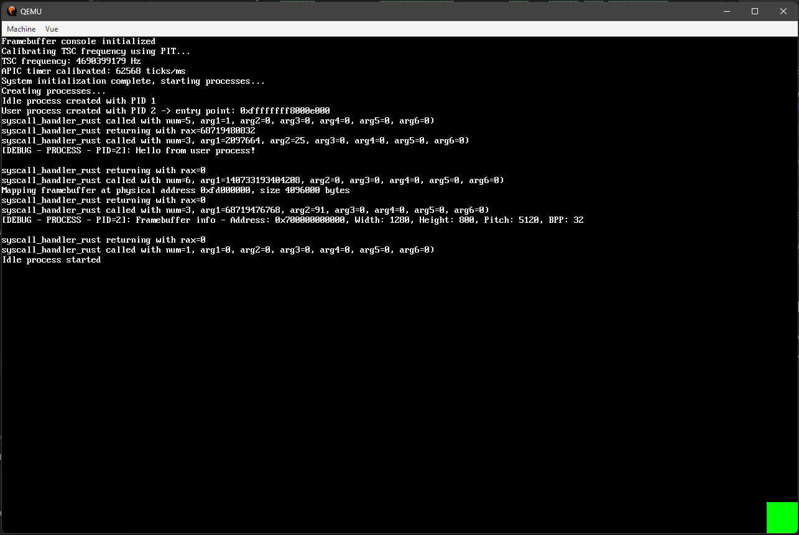

# RustyOS


*Le carré vert en bas à droite est le processus utilisateur qui s'est bien exécuté*

Un kernel x86_64 minimaliste écrit en Rust, développé comme projet personnel pour explorer l'architecture bas niveau et apprendre le langage.

> **Note :** C'est aussi mon premier projet Rust. Venant du C, mon code n'exploite pas encore pleinement les idiomes du langage. Une réécriture est prévue dans une seconde phase, une fois que j'aurai une compréhension plus complète de l'ensemble du système.

---

## Fonctionnalités implémentées

**Boot & mémoire**
- Intégration Limine (boot info, ramdisk)
- Allocateur de frames, VMM avec pagination 4K, heap kernel

**CPU & interruptions**
- Gestion des interruptions
- Gestion des rings 0 et 3
- Initialisation PIC → TSC → APIC (chaque timer est calibré sur le précédent)

**Processus**
- Ordonnanceur de processus
- Processus système (ring 0) et processus utilisateur (ring 3)
- Syscall depuis ring 3

**I/O & debug**
- Framebuffer pour l'affichage
- Serial pour le debug (avant framebuffer)
- Chargement d'ELF statique depuis ramdisk (sans relocation pour l'instant)

---

## Roadmap

```
VFS → IPC → Clavier PS/2 → Shell
```

---

## Build

**Dépendance :** `xorriso`
- Linux : via le gestionnaire de paquets
- Windows : via MSYS2, ou définir la variable d'environnement `XORRISO` avec le chemin vers l'exécutable

Le projet utilise `xtask` :

```bash
cargo xtask iso
```

Produit `./rustyos.iso`, bootable BIOS et UEFI.

**Lancer sous QEMU :**

```bash
qemu-system-x86_64 -cdrom ./rustyos.iso -m 256M -serial stdio
```

---

## Compatibilité

| Environnement | Statut |
|---|---|
| QEMU (sans KVM) | ✅ Fonctionnel |
| VMware | ✅ Fonctionnel |
| Intel 5th / 10th / 13th gen (bare metal) | ✅ Testé sur 2 laptops + 1 tour |
| AMD Ryzen 9 7900X | ❌ Triple fault au boot (cause non identifiée) |
